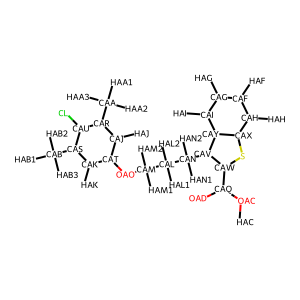
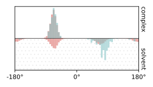
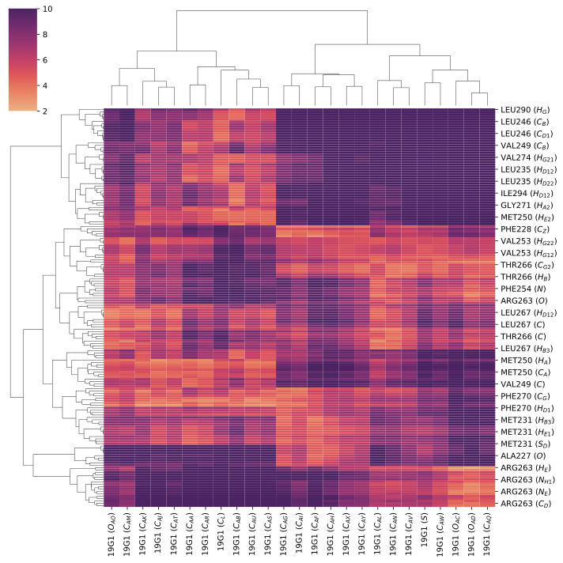
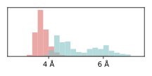
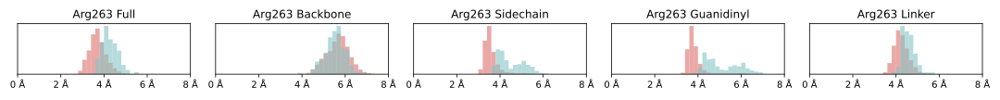

# Quantum for Bio MM-ML Analysis

In this repository, structural ensembles of a ligand, bound by a protein or in solvent, produced with either classical MM simulations and resampling using a ML force field, are compared.

#### Contents
```sh
├── README.md
├── download_data.sh    # Script to download data used in analysis
├── env.yaml            # Requirements file to create conda environment
├── data/               # System PDB structures and XTC trajectories of ensembles
├── notebooks/          # System-specific notebooks to run analysis
├── plots/              # Plots from analysis
├── structures/         # Representative structures and structure visualization gifs
└── src/
    └── utils.py        # Utils used for analysis
```


## Getting started

Clone the repository:
```sh
git clone q4b-mm-ml
cd q4b-mm-ml
```

Initialise an environment:
```sh
conda create -f env.yaml
conda activate q4b
```

Download the data used for the analysis from [this database](https://sid.erda.dk/cgi-sid/ls.py?share_id=kP7PWXatuX) at the [Electronic Research Data Archive ERDA](https://erda.dk/) (Requires granted access):

```sh
bash download_data.sh
```


## Usage

The following is a guide to perform a comparative analysis of MM and ML endstate structural ensembles of in a notebook using the provided functions.

Further documentation and function capabilities can be found in the docstrings in `src/utils.py`.


### 1. Setup
Load the `src/utils.py` module:
```python
from utils import *
```

Depending on one's setup, this may require specifying its location to the Python path environment variable. For instance:
```python
import sys
import os

sys.path.append(os.path.join('../src')) # From notebooks/
from utils import *
```


### 2. Data
The structural ensembles for both the ligand bound to protein `complex` and in solvent `solvent` for both the classical MM ensemble `mm` and the ML forcefield ensemble `ml` should be loaded as [MDAnalysis Universe objects](https://userguide.mdanalysis.org/stable/universe.html):

```python
import MDAnalysis as mda
mm_complex = mda.Universe('[...].pdb', '[...].xtc')
mm_solvent = mda.Universe('[...].pdb', '[...].xtc')
ml_complex = mda.Universe('[...].pdb', '[...].xtc')
ml_solvent = mda.Universe('[...].pdb', '[...].xtc')
```

To use the tools in `utils`, it is a prerequisite that one is familiar with the [MDAnalysis selection query syntax](https://docs.mdanalysis.org/stable/documentation_pages/selections.html), which is used by `mda.Universe.select_atoms()`, such as `'protein and resid 263'`.


#### 2.1 Atom names
When selecting atoms of interest, it is practical to know the specific atom names that have been assigned to the molecule of interest. For this, the `utils` provides a function `print_atom_names` that draws an image of a specified atom selection with the atom names as labels.

For instance, the ligand atom names can be checked by:
```python
print_atom_names(mm_complex, 'resname [...]')
```

Or for the standard atom names of a protein residue:
```python
mm_complex.select_atoms('protein and resid [...]').guess_bonds()
print_atom_names(mm_complex, 'protein and resid [...]')
```

Protein bonds are not specified in PDB files by default. Therefore, protein residue bonds must be inferred beforehand, for instance with the MDAnalysis `.guess_bonds()` method.

The function produces a plot like this:
<figure align="center">
  
  <figcaption>
    <i>A ligand labelled with its atom names. Produced using <code>print_atom_names()</code>.</i> 
  </figcaption>
</figure>


### 3. Ligand rotamers
The first major aspect of the analysis, is the comparison of ligand dihedral angles, both in the context of its bound and unbound state, as well as in the MM and ML ensembles.

A dihedral angle can be calculated over a structural ensemble using the `dihedral_time_series` function, which takes an MDAnalysis atom selection object of four ligand atoms.
```python
dihedrals = dihedral_time_series(mm_complex.select('resname [ligand] and name [...] [...] [...] [...]'))
```

A plot comparing a ligand dihedral angle in `complex` (top) vs `solvent` (bottom) and `mm` (red) vs. `ml` (blue) contexts can be generated with the `plot_ligand_dihedral_distributions` function, which takes a query for the ligand, the names of the atoms in the dihedral angle, the four structural ensembles:

```python
plot_ligand_dihedral_distributions('resname [ligand]',
                                   ('[atom1]','[atom2]','[atom3]','[atom4]'),
                                   mm_complex, mm_solvent, ml_complex, ml_solvent,
                                   atom_name_scheme='complex',)
```

Note that the function takes an argument `atom_name_scheme` that specifies whether the ligand atom names are derived from ligand naming in `complex` or `solvent`, which may differ. The function will automatically map between names in the two binding contexts.

The function produces a plot like this:
<figure align="center">
  
  <figcaption>
    <i>The distribution of a ligand dihedral angle for both a MM (red) and ML (blue) ensemble in a bound (top) and unbound (bottom) context. (Grey) signifies overlap. Produced using <code>plot_ligand_dihedral_distributions()</code>.</i> 
  </figcaption>
</figure>


### 4. Protein-Ligand distances
The second major aspect of the analysis, is the comparison of protein-ligand distances in the bound state in the MM and ML ensembles.

With regards to ligand dihedral angles, there is most often only a limited number of dihedrals to choose from. The combinatorics of protein and ligand atoms, however, most often yield an unmanageable number of distance probes to choose from.

Therefore, the `utils` is equipped with tools both to explore the many possible protein-ligand distance probes, as well as to create refined plots of select ones.


#### 4.1 Distance definitions
Distances are defined either between single atoms or between the center-of-mass (COM) of groups of atoms.

The distances between all single atom pairs between two selections can be calculated with the `dihedral_time_series` function, which takes a MDAnalysis universe and two atom selections from that universe:
```python
selection1 = mm_complex.select_atoms('[...]')
selection2 = mm_complex.select_atoms('[...]')
distances = distance_time_series(mm_complex, selection1, selection2)
```

The distance between the center-of-mass of two selections can be calculated with the `distance_com_time_series` function, which takes a similar input:
```python
selection1 = mm_complex.select_atoms('[...]')
selection2 = mm_complex.select_atoms('[...]')
distance = distance_com_time_series(mm_complex, selection1, selection2)
```

#### 4.2 Distance heatmap
For an initial impression of which protein resides that lie close to the ligand, which may be of interest as probes, the function `plot_distance_matrix`, takes a structural ensemble and two atom selection queries, and provides a clustered heatmap of either mean or median distances between ligand atoms and nearby protein atoms:
```python
plot_distance_matrix(
    mm_complex,
    "resname [ligand] and not element H",
    "protein and around 5 resname [ligand]",
    measure='mean',
    sel2_cutoff=5)
```

The function produces a plot like this:
<figure align="center">
  
  <figcaption>
    <i> A heatmap of mean distances in Å between ligand atoms (horisontal) and nearby protein atoms (vertical). Produced using <code>plot_distance_matrix()</code>.</i> 
  </figcaption>
</figure>


#### 4.3 Final distance distributions
When a final set of probes between ligand atoms and protein atoms have been selected (see 5.4), the `plot_com_distance_distributions` function can produce a plot that compares the distance distribution between the center-of-mass of two atom selections for both the `MM` and  the `ML` structural ensemble:

```python
plot_com_distance_distributions(
    mm_complex,
    ml_complex,
    'protein and resid [residue] and name [residue atoms]',
    'resname [ligand] and name [ligand atoms]')
```

The function produces a plot like this:
<figure align="center">
  
  <figcaption>
    <i> The distribution of center-of-mass differences between two atom selections for both a MM (red) and ML (blue) ensemble. Produced using <code>plot_com_distance_distributions()</code>.</i> 
  </figcaption>
</figure>


#### 4.4 Exploring distance distributions
By examining the structure, by considering a distance heatmap, by prior knowledge about interesting interactions, or by trial and error, one can get somewhat of an idea of which residue-ligand could be interested to consider when comparing `MM` and `ML`.

However, the comparison between the entirety of a residue and the entirety of the ligand is not often nearly as relevant as the comparison between certain subsets of atoms between the two. For instance, between a residue's positively charged amine and a ligand's negatively charged carboxylic acid.

With a subset of residues of interest in hand, `utils` provides two functions to uncover a more meaningful subselection of atoms.

The first of these is `plot_residue_substructure_com_distance_distributions`, which takes takes both the `MM` and `ML` bound state ensembles, a *single protein residue selection query*, and an atom selection query for the ligand, and provides distance distribution plots between each of a built-in set of amino acid chemical substructures and the ligand atom selection.

```python
plot_residue_substructure_com_distance_distributions(
    mm_complex,
    ml_complex,
    'protein and resid [residue]',
    'resname [ligand] and name [ligand atoms]',
    hydrogen=False)
```

An optional parameter `hydrogen` denotes whether hydrogen atoms should be included in the center-of-mass calculations.

The function produces a plot like this:
<figure align="center">
  
  <figcaption>
    <i> The distance distribution between a ligand atom selection and characteristic substructures of a selected amino acid (Arg) for both a MM (red) and ML (blue) ensemble. Produced using <code>plot_residue_substructure_com_distance_distributions()</code>.</i> 
  </figcaption>
</figure>

The second function is `plot_single_atom_distance_distributions`, which takes both the `MM` and `ML` bound state ensembles and two atom selections queries, and returns pairwise distance distribution plots for all atoms pairings between the two selections:

```python
plot_single_atom_distance_distributions(
    mm_complex,
    ml_complex,
    'protein and resid [...]',
    'resname [ligand] and name [atoms of interest]')
```

The function produces a (big!) plot like this:
<figure align="center">
  
  <figcaption>
    <i> The distance distribution between all selected ligand atoms atom pairs between two selections for both a MM (red) and ML (blue) ensemble. Produced using <code>plot_single_atom_distance_distributions()</code>.</i> 
  </figcaption>
</figure>

Together, the two functions allows one to explore which substructures of residues, or eve which single atoms, which are of interest in comparing the `MM` and `ML` ensemble.


##### 4.4.1 Substructure definitions
The `plot_residue_substructure_com_distance_distributions` function subselects parts of the protein residue by appending an additional substructure query to the original selection query for the residue. These appended substructure queries are found in the table below:

| Amino Acid | Substructure | Substructure query |
|------------|--------------|-------|
| All amino acids | All | all |
| | Backbone | backbone |
| | Sidechain| not backbone |
| Gly    |  [N/A]            |    [N/A]   |
| Ala    | Methyl       | name CB HB1 HB2 HB3 |
| Val    | Methyl (1)   | name CG1 HG11 HG12 HG13 |
|            | Methyl (2)   | name CG2 HG21 HG22 HG23 |
|            | Isopropyl    | name CB HB CG1 HG11 HG12 HG13 CG2 HG21 HG22 HG23 |
| Leu    | Methyl (1)   | name CD1 HD11 HD12 HD13 |
|            | Methyl (2)   | name CD2 HD21 HD22 HD23 |
|            | Isopropyl    | name CG HG CD1 HD11 HD12 HD13 CD2 HD21 HD22 HD23 |
|            | Isobutyl     | name CB HB2 HB3 CG HG CG HG CD1 HD11 HD12 HD13 CD2 HD21 HD22 HD23 |
| Ile    | Methyl (Delta) | name CG2 HG21 HG22 HG23 |
|            | Methyl (Gamma) | name CD1 HD11 HD12 HD13 |
|            | Ethyl        | name CG1 HG12 HG13 CD1 HD11 HD12 HD13 |
| Pro    | Pyrrolidine  | name CA CB CG CD N |
| Ser    | Hydroxyl     | name OG HG |
| Thr    | Hydroxyl     | name OG1 HG1 |
|            | Methyl       | name CG2 HG21 HG22 |
| Cys    | Thiol        | name SG HG |
| Met    | Thioether    | name SD |
|            | Methyl       | name CD HE1 HE2 HE3 |
|            | Methyl thioether | name SD CD HE1 HE2 HE3 |
|            | Linker       | name CB HB2 HB3 CG HG2 HG3 |
| Asn    | Amide        | name ND2 HD21 HD22 OD1 |
| Gln    | Amide        | name NE2 HE21 HE22 OE1 |
|            | Linker       | name CB HB2 HB3 CG HG2 HG3 |
| Asp    | Carboxyl     | name CG OD1 OD2 |
| Glu    | Carboxyl     | name CD OE1 OE2 |
|            | Linker       | name CB HB2 HB3 CG HG2 HG3 |
| Lys    | Amino        | name NZ HZ1 HZ2 HZ3 |
|            | Linker       | name CB HB2 HB3 CG HG2 HG3 CD HD2 HD3 CE HE2 HE3 |
| Arg    | Guanidinyl   | name NH1 HH11 HH12 NH2 HH21 HH22 NE HE CZ |
|            | Linker       | name CB HB2 HB3 CG HG2 HG3 CD HD2 HD3 |
| His    | Imidazole    | name CG ND1 HD1 CD2 HD2 CE1 HE1 NE2 HE2 |
| Phe    | Phenyl       | name CG CD1 HD1 CD2 HD2 CE1 HE1 CE2 HE2 CZ HZ |
|            | Benzyl       | name CB HB2 HB3 CG CD1 HD1 CD2 HD2 CE1 HE1 CE2 HE2 CZ HZ |
| Tyr    | Hydroxyl     | name OH HH |
|            | Phenyl       | name CG CD1 HD1 CD2 HD2 CE1 HE1 CE2 HE2 CZ |
|            | Benzyl       | name CB HB2 HB3 CG CD1 HD1 CD2 HD2 CE1 HE1 CE2 HE2 CZ |
|            | m-Cresoyl    | name CB HB2 HB3 CG CD1 HD1 CD2 HD2 CE1 HE1 CE2 HE2 CZ OH HH |
| Trp    | Indole       | name CG CD1 HD1 CD2 NE1 HE1 CE2 CZ2 HZ2 CH2 HH2 CZ3 HZ3 CE3 HE3 |
|            | Benzene      | name CD2 CE2 CZ2 HZ2 CH2 HH2 CZ3 HZ3 CE3 HE3 |
|            | Pyrrole      | name CG CD1 HD1 CD2 NE1 HE1 CE2 |


## Contact

Frederik Espersen Knudsen - [frederikespersen@icloud.com](frederikespersen@icloud.com)
